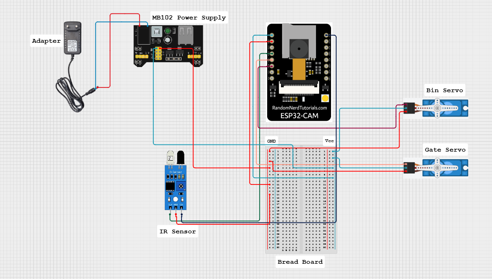

# ♻️ Smart Dry Waste Classification System

An AI-powered IoT-based system that automatically classifies dry waste into categories like **plastic, paper, and metal** using computer vision and smart hardware integration.

---

## 🚀 Project Overview

The **Smart Dry Waste Classification System** is designed to improve waste segregation efficiency using:

- 📷 **ESP32-CAM** for image capture  
- 🤖 **Deep Learning Model (CNN)** for classification  
- ⚙️ **Servo Motors & IR Sensors** for automated sorting  
- ☁️ **Cloud Dashboard** for monitoring predictions and analytics  

---

## 🌐 Live Dashboard

🔗 **Try the live system here:**  
👉 https://huggingface.co/spaces/Vish2711/Waste_Prob_Dashboard

---

## 🧠 Features

- ✅ Real-time waste classification  
- ✅ High accuracy prediction (~99%)  
- ✅ Automated bin segregation  
- ✅ Cloud-based monitoring dashboard  
- ✅ Probability visualization of predictions  
- ✅ Low-cost and scalable solution  

---

## 🛠️ Tech Stack

### 💻 Software & AI
- **Python**
- **TensorFlow / Keras** (CNN Model)
- **OpenCV** (Image Processing)
- **NumPy & Pandas** (Data Handling)
- **Matplotlib / Seaborn** (Visualization)

### 🌐 Cloud & Deployment
- **Hugging Face Spaces** (Live Dashboard Hosting)
- **Streamlit / Flask** (Web Interface)

### 🔧 Hardware & IoT
- **ESP32-CAM** (Image Capture + Processing)
- **IR Sensor** (Object Detection)
- **Servo Motors** (Automated Sorting Mechanism)
- **MB102 Power Supply Module**
- **Breadboard & Jumper Wires**

---

## 🏗️ System Architecture

### ☁️ Cloud Platform Dashboard
Displays:
- Total classified waste
- Last prediction
- Confidence score
- Waste distribution graph


---

### 🔌 Hardware Circuit Design

Components used:
- ESP32-CAM  
- MB102 Power Supply  
- IR Sensor  
- Servo Motors (Bin & Gate)  
- Breadboard & Jumper Wires  



---

### 🛠️ Hardware Prototype

Real implementation of the smart waste system:


---

## ⚙️ Working Process

1. Waste is placed in the input section  
2. IR Sensor detects object presence  
3. ESP32-CAM captures image  
4. Image sent to ML model for classification  
5. Based on prediction:
   - Servo rotates to correct bin  
6. Data is updated on cloud dashboard  

---

## 📊 Model Details

- Model Type: Convolutional Neural Network (CNN)  
- Classes:
  - Plastic  
  - Paper  
  - Metal  
- Output: Probability scores for each class  

Example:
```json
{
  "metal": 0.0000000007,
  "paper": 0.0027,
  "plastic": 0.9972
}
